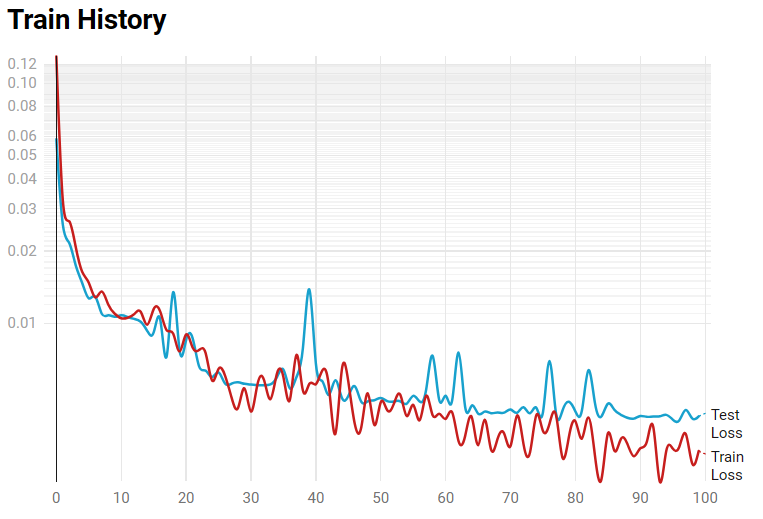

# Pho2Vis

使用深度学习模型，基于全天空成像仪所拍摄的圆形天空图片进行大气能见度预测

## 最终结果

1. **模型结构**：DenseNet121将分类层改为3个全连接层
2. **数据处理**：使用k-近邻进行缺失值填充，进行min-max归一化
3. **训练过程**：将两张不同曝光度的图像在宽度上拼接，然后输入模型中，在第一个fc层前得到高维向量，将它与AOD、RH指标拼接，再输入到全连接层进行训练
4. **训练参数**：lr:1e-3，epoch:100，batch size:32，Loss:MSE，训练平台：kaggle
5. **训练结果**：
  对数据进行min-2369.3, max-15000.0归一化后的最佳MSE是0.00400886520087211
  那么回到原来的数据，其误差分别为：

- MSE: 646072.5913615881
- RMSE: 803.786409042594
- MAE: 499.32644165963404
- R²: 0.9680391082168751
