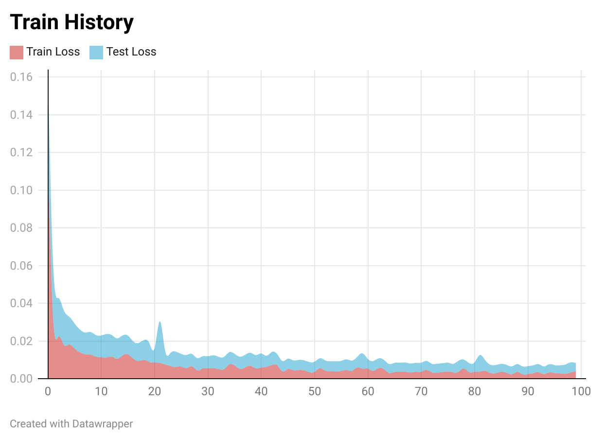

# Pho2Vis
使用深度学习模型，基于全天空成像仪所拍摄的圆形天空图片进行大气能见度预测

## 目前进度
1. 实现了读取数据集的Dataset类
2. 微调预训练模型DenseNet121
3. 整体训练和评估模型的大概框架已完成

## 目前问题 1.0
1. 由于没有测试集数据，不确定对训练集的读取是否能应用于测试集
2. 在数据处理上，目前是将不同曝光度的Image作为不同的图片进行训练，**但是**，还可以将两张图片进行拼接后进行训练，暂时没有对这个进行实现。
3. 还没开始训练模型，预计使用kaggle，GPU P100
4. 训练模型的框架还有一些没写完

## 目前问题 2.0
1. 训练已经完成，但是由于AOD缺失太多，使用k-近邻进行填充，可见度也有3条空数据，将数据min-max归一化，范围是0-1，对测试集也使用训练集的min-max进行归一化
2. 大约2分钟一个epoch，在训练100轮次后，模型最终在测试集上的MSE是0.004左右，在第50的epoch左右模型几乎已经收敛
3. 数据样本过少，训练集1344条数据（AOD大约有800条缺失），测试集336条数据（AOD大约有200条缺失），比例约为4:1

## 最终结果
1. **模型结构**：DenseNet121将分类层改为3个全连接层
2. **数据处理**：使用k-近邻进行缺失值填充，进行min-max归一化
3. **训练过程**：将两张不同曝光度的图像在宽度上拼接，然后输入模型中，在第一个fc层前得到高维向量，将它与AOD、RH指标拼接，再输入到全连接层进行训练
4. **训练参数**：lr:1e-3，epoch:100，batch size:32，Loss:MSE，训练平台：kaggle
5. **训练结果**：
5. **训练结果**：
  对数据进行min-2369.3, max-15000.0归一化后的最佳MSE是0.00413676192031496
  那么回到原来的数据，其误差分别为：
- MSE: 1248030.39
- RMSE: 1117.15
